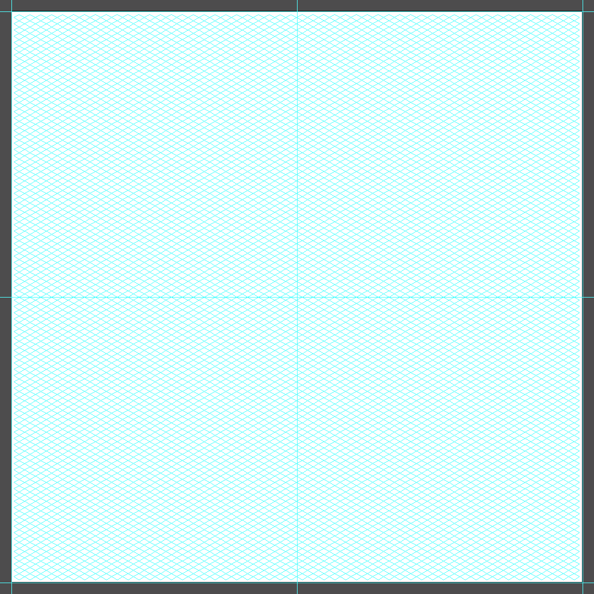

# Axonometric

Axonometric templates and info.

> Axonometric projection is a type of parallel projection used for creating a pictorial drawing of an object, where the object is rotated along one or more of its axes relative to the plane of projection.

> The four types of axonometric projections are isometric projection, dimetric projection, trimetric projection, and oblique projection, depending on the exact angle at which the view deviates from the orthogonal.

> – [Axonometric projection](http://en.wikipedia.org/wiki/Axonometric_projection)

## Template: `iso.ait`

Used to create isometric (30º angles) pixel art.

**Recommended preference:**

Or using [VectorScribe](http://www.astutegraphics.com/software/vectorscribe/)’s “protractor” panel:

## Tips

Recommended preference settings:

### Using Hot Door, Inc.’s CADtools 7

**Question:**

> How do I set the CADaxonometric to work with 45º and 30º axo/iso grids? When I type in 45º in both 3d boxes, and click on a cube face, that doesn't seem to align my object to the 45º grid (for example).

**Answer:**

> That’s because the angles are in 3D, not 2D. In CADtools 7, as you know, we had 2D angle fields that would translate into 3D. We removed them due to time constraints (the calculations were very intense), but plan to add them back in CADtools 10. In the meantime, here are the 2D to 3D settings you can use:

> 2D | 3D
--- | ---
45 x 45 | 45 x 80
15 x 60 | 21 x 42
15 x 45 | 27 x 31
15 x 30 | 34 x 23

## Links

* [Hot Door CADtools](https://www.hotdoor.com/cadtools)